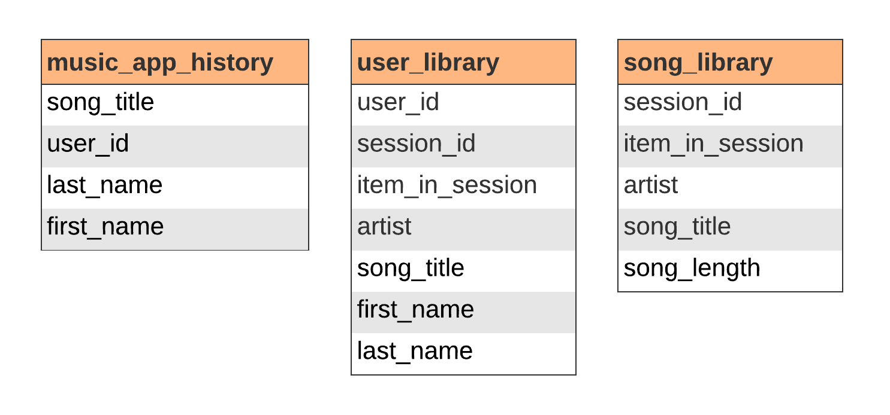

# Modeling Data using Cassandra

This project models song streaming data for analysis. The data is initially stored in CSV format. 

I want to model this dataset as an Apache Cassandra keyspace. I then want to create an ETL pipeline that takes the CSV files and uploads them to the server. This will accomplish two things:

1. It will allow for the tracking of user activity by organizing the data into three denormalized tables.

2. It will prioritize availability over consistency, optimizing the querying process and making the data amenable to horizontal scaling.

## Keyspace

There are three tables in the keyspace:

1. 

## Project Organization

This schema can be replicated and populated by running the below two scripts:

- <b>create_tables.py</b>: This script creates and connects to a database named `sparkifydb` and creates the three tables via the <b>cql_queries.py</b> file (CQL is the Cassandra query language).
- <b>etl.py</b>: This script connects to the database, extracts and transforms the CSV filess into a single CSV file, and loads the data into the database according to the schema—also via the <b>cql_queries.py</b> file.

The notebook <b>test.ipyb</b> allows for testing the database connection and running CQL queries on it.